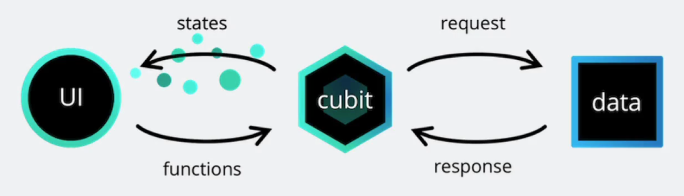
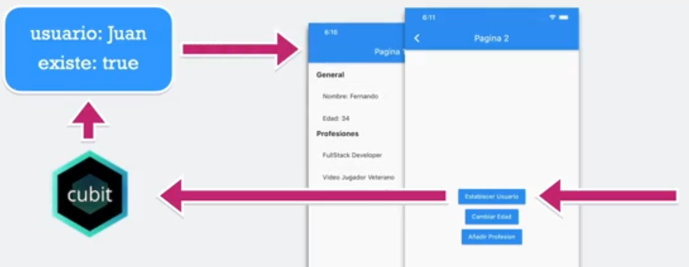

# ESTADOS

Una de las cosas más importantes de una app es saber el estado de la misma, como cambia la información y como actualizar los widgets en tiempo real en la UI cuando algo sucede.

## Inicio de proyecto

Creamos el proyecto usando VSCode y el plugin de Flutter. Indicamos el nombre `estados` y una vez creado le cambiamos el nombre a `03-estados`.

Entramos al proyecto, vamos al archivo `lib/main.dart`, borramos todo el contenido y escribimos lo siguiente para generar el código de inicio: `mateapp` y pulsamos `Tab`.

En la carpeta `lib` creamos la carpeta `pages` y dentro estas dos páginas: `pagina1_page.dart` y `pagina2_page.dart`.

En cada una de ellas, para crear un código inicial, escribimos lo siguiente: `stless` y pulsamos `Tab`.

Vamos a crear una forma de mostrar la información ya que el objetivo es ver diferentes formas de mantener el estado de la aplicación.

## Diseño de ambas pantallas

Va a ser un diseño sencillo, porque el objetivo no es aprender a diseñar, sino dejar preparadas las pantallas para empezar a trabajar con los estados para poder manejarlo, y poder manipular de manera simultanea las pantallas.

En `pagina2_page.dart` es donde van a estar unas opciones para cambiar valores del estado de la aplicación.

Vamos a crear un modelo que nos va a ayudar a mantener la información del usuario. Para ello, creamos una carpeta `models` dentro de `lib` y dentro de ella el archivo `usuario.dart`.

## Preparar repositorio y ramas

Trabajaremos en distintas ramas, manteniendo el diseño de las pantallas y el modelo de usuario, pero cambiando la forma de manejar el estado.

### Singleton

Singleton puede ser una buena opción cuando queremos hacer una petición HTTP, traer la información y mostrarla, sin querer mantener el estado y para descentralizar la lógica de negocio de la app con el UI.

Lo tenemos en su propia rama `singleton`.

### Provider

Provider nos ayuda a mantener un Singleton de la clase que queramos implementar, pero a la vez, dependiendo del nivel donde pongamos el MultiProvider, podemos tener diferentes instancias de la misma clase en diferentes niveles de la aplicación.

Lo tenemos en su propia rama `provider`.

### Cubit

Un Cubit es una especie de mezcla entre Provider y BLoC. Sus creadores recomiendan empezar con Cubit y, si tenemos necesidades más robustas, podemos escalarlo fácilmente a BLoC, cambiando la forma de emisiones por eventos.

Lo tenemos en su propia rama `cubit`.

**Cómo funciona un Cubit**

Tenemos nuestra interfaz visual, que va a disparar funciones o métdos que se encuentran dentro del Cubit. El cubit recibe esa petición y puede regresar un nuevo estado o mantener el mismo. El UI se va a volver a dibujar cuando haya un cambio de estado.

La idea también es que el estado sea inmutable. Cada vez que se haga alguna modificación regresará un nuevo estado, sin mutar el anterior.

El Cubit también puede disparar una petición HTTP a una API para traer la data. Cuando la data entra al Cubit, este regresará un nuevo estado con la información que ya viene en la data. El nuevo estado será recibido por la UI, que se redibujará si esta data ha cambiado.

Imagen del funcionamiento de Cubit en nuestra app.

La idea es muy parecida al StreamBuilder, pero más sencillo.

#### Continuación de proyecto Cubit

Para trabajar con Cubit es obligatorio aprender bien lo que son los streams.

Ver: `https://bloclibrary.dev/es/bloc-concepts/#streams`

Tenemos que instalar el paquete `flutter_bloc`: `https://pub.dev/packages/flutter_bloc`

#### Creando nuestro primer Cubit

En el directorio `lib` nos creamos una carpeta `bloc`. Dentro de esta nueva carpeta, creamos otra carpeta `usuario`.

Dentro de esta última carpeta creamos el archivo `usuario_cubit.dart`. Este es el cubit como tal, que se encarga de hacer las peticiones HTTP y cambia el estado. Nos creamos un segundo archivo que englobará todos los posibles estados que permite nuestra app, llamado `usuario_state.dart`.

El primer archivo `usuario_cubit.dart` es el que va a administrar los cambios de estados de `usuario_state.dart`.

#### Cambiando el UI en base al estado del cubit

Vamos a utilizar el estado inicial de nuestro Cubit para cambiar el UI de manera condicional.

Si tengo usuario, vamos a mostrar su información. Si no lo tengo, mostraremos un texto indicándolo.

Cambiamos `main.dart` para disponer el Cubit a lo largo de toda la app colocándolo en el context (mi árbol de Widgets).

Modificamos `pagina1_page.dart` para usar un Cubit que ya está en el context.

#### Cambiar a un nuevo estado

Cuando, desde `pagina2_page.dart` toquemos el botón `Establecer Usuario` vamos a cambiar el estado.

Modificamos `usuario_state.dart` para crear la clase `UsuarioActivo` con el estado que quiero.

Modificamos `usuario_cubit.dart` para añadir un método `seleccionarUsuario()`.

Modificamos `pagina2_page.dart` para llamar al Cubit.

#### Mostrar información del usuario

Modificamos `pagina1_page.dart` para mostrar la información del usuario.

#### Cambiar la edad del usuario dentro del Cubit

Modificamos `pagina2_page.dart` para cambiar la edad del usuario al pulsar el botón `Cambiar Edad`.

Sabemos que para cambiar el estado necesitamos llamar algo que se encuentre en el Cubit.

Modificamos `usuario.dart` para hacer las propiedades `final` para que no se puedan mutar y vamos a crear un método `copyWith()` para que nos devuelva una nueva instancia de `Usuario`.

Modificamos `usuario_cubit.dart` para crear un método `cambiarEdad()`.

#### Añadir profesión

Modificamos `pagina2_page.dart` para añadir una profesión al pulsar el botón `Añadir Profesión`. La profesión va a ser de tipo `Profesión 3, Profesión 4...`.

Modificamos `pagina1_page.dart` para añadir un botón que, al pulsarlo, borre el usuario.

Modificamos `usuario_cubit.dart` para crear dos métodos: `agregarProfesion()` y `borrarUsuario()`.