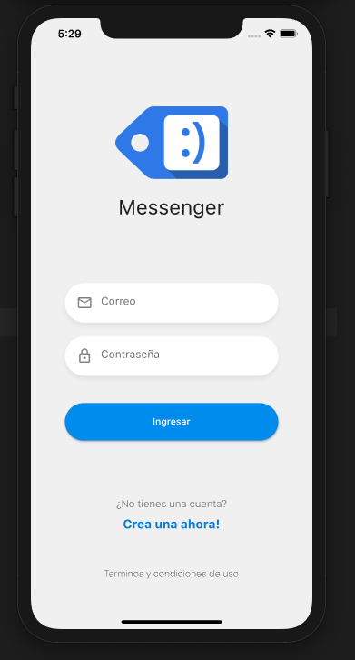

# FLUTTER AVANZADO: LLEVA TU CONOCIMIENTO AL SIGUIENTE NIVEL

Del curso DevTalles https://cursos.devtalles.com/courses/flutter-avanzado

## 01-band_names

### BandNamesApp - Socket.io - Aplicación en tiempo real

En esta sección se hace solo la parte del diseño, que es quizás lo menos importante de la app.

Lo más importante va a ser como se realiza la comunicación en tiempo real con un backend usando sockets.

#### Temas puntuales de la sección

Aquí tocaremos temas sobre:

- Diseño de la aplicación
- inputDialog para IOS y Android
- Dismissible
- Trabajar con listas

La aplicación visualmente es básica, pero nos ayudará a preparar el terrenos para conectarla a un socket server que haremos en la sección que sigue a esta. Luego le integraremos gráficas en tiempo real y todo el proceso CRUD mediante sockets.

## 01-band_names_server

### BandNamesApp - Socket Server - Express - Backend

En esta sección creamos desde cero el backend de nuestra app usando Node. Vamos a user el paquete `socket.io` porque queremos usar `websockets` y que nuestro servidor mantenga una conexión activo-activo con los clientes conectados.

Indicar que esta app en Node no es recomendable usarla en Producción. Más adelante en el curso se realiza otro backend mucho más completo y que si será posible usar en Producción si queremos.

#### Temas puntuales de la sección

Aquí tocaremos temas sobre:

- Crear un backend en Node
- Crear directorios públicos
- Variables de entorno
- Configuración de Socket.io
- Emitir y escuchar eventos
- Separar la lógica en diferentes archivos
- Realizar respaldos en GitHub
- Procedimiento para escuchar cuando un cliente se conecta y se desconecta

Ejemplo de creación de tag: `git tag -a v1.0.0 -m "Socket Server Básico"`.

Ejemplo de puhs del tag: `git push --tags`.

## BandNames Flutter + Socket Backend

Vamos a conectar nuestra aplicación de Flutter con nuestro backend, y ambos van a trabajar como si fueran uno solo.

La idea es que mi aplicación de Flutter le mande un mensaje al servidor, y este lo distribuya a todos los clientes conectados. Si un cliente se conecta recibirá la información actualizada a como esté en ese instante.

#### Temas puntuales de la sección

En esta sección tocaremos los siguientes temas:

- Conectarnos a nuestro socket server
- Escuchar y emitir eventos desde y hacia Flutter
- Indicadores visuales del estado de la conexión
- Re-conexión al socket server
- CRUD basado en Sockets
- Gráficas en tiempo real

## Desplegar Socket Server en mi Raspberry Pi

Aquí hay una cosa muy importante que decir, cuando subamos la app Flutter a las Apps Stores, si se usa un server, este tiene que tener un certificado HTTPS.

## 02-chat

### RealTime Chat Socket.io - Mongo - Express - JWT - Login y Registro

Aplicación de chat en tiempo real con autenticación por JSON Web Token, grabación en MongoDB, comunicación entre dispositivos en tiempo real, manejar la creación de cuentas...

#### Temas puntuales de la sección

Aquí tocaremos temas sobre:

- Diseño de la pantalla de Login y Registro
- CustomInputFields
- Scrollviews
- Navegaciones entre pantallas

Esta no es una sección complicada, es puro diseño e ir preparando el terreno para el objetivo final que es crear una aplicación completa de mensajería.

#### Diseño del LoginPage

### Usuarios y Mensajes

Continuación de la sección anterior.

Aquí vamos a trabajar en la pantalla de usuarios. Lo más importante es saber el estado del socket server, saber qué usuarios están conectados, hacer un pull to refresh y pasar a la pantalla de mensajería (chat) uno a uno, cuyo diseño será parecido al de Messenger.

#### Temas puntuales de la sección

Aquí tocaremos temas sobre:

- Pull to refresh
- Diseño de la pantalla de chat
- Mensajes con animaciones
- Listview invertida

La idea es hacer un diseño similar a iMessage o el Messenger de Facebook, para que se mire atractivo y que ustedes puedan seguir expandiendo su funcionalidad.